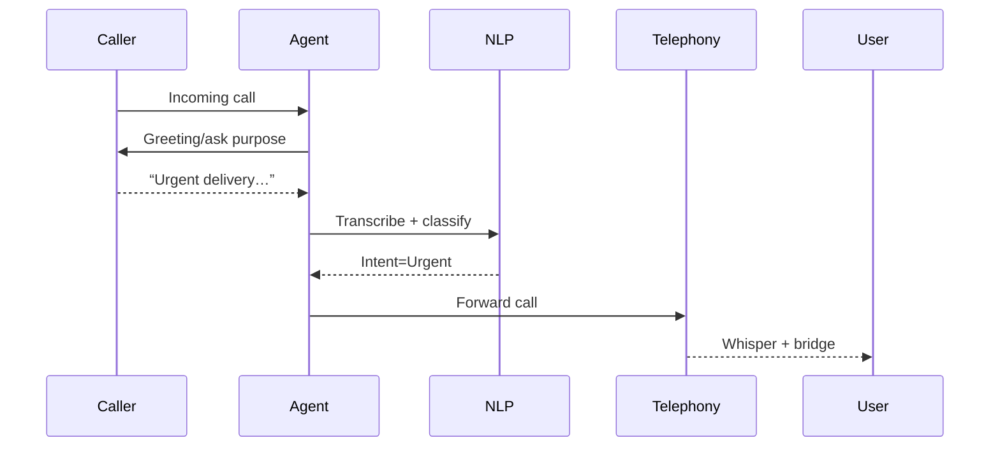
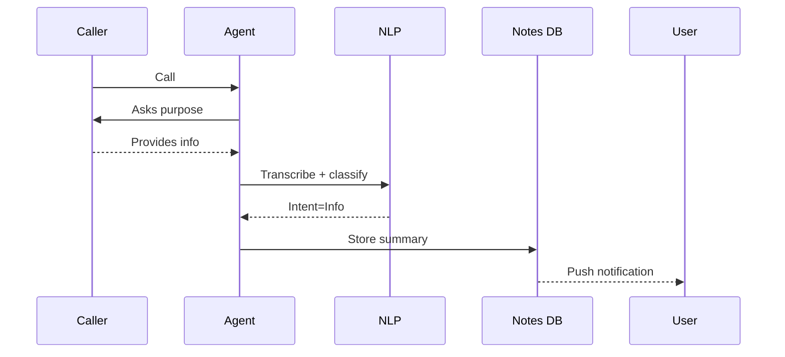

# Voice Agent – Phase 1 Product Requirements Document

The Voice Agent aims to transform every unknown phone call into a structured event that either reaches the user instantly or is captured for later action. By scoping the first release to a lean, easy-to-ship feature set, the product can start delivering value within weeks while laying the groundwork for richer conversational workflows in Phase 2.

## Overview

Consumers still receive billions of unwanted or time-wasting calls annually, yet they also risk missing critical calls when they step away from their phones. Existing solutions either block spam or record voicemail; few pick up, classify intent in real-time, then execute a task on the user’s behalf. Voice Agent Phase 1 closes that gap: it screens every unknown call, detects caller intent, and immediately performs one of three simple actions—forward, note, or schedule—without user intervention.

## Goals \& Non-Goals

### Goals

- Auto-answer and classify 100% of calls from unknown numbers.
- Deliver three post-intent tasks with ≤1.5 s latency:

1. Forward urgent calls.
2. Store concise notes.
3. Create calendar items, reminders, or alarms.
- Provide privacy-first, on-device speech processing for English.


### Non-Goals

- Multi-language support (deferred to Phase 2).
- Mutual availability negotiation (Phase 2).
- Complex risk analysis, billing integrations, or voice cloning.


## Key Personas

| Persona | Primary Need | Context Snapshot | Pain Today | Desired Outcome |
| :-- | :-- | :-- | :-- | :-- |
| Busy Professional | Filter noise yet never miss urgent calls | Works remotely; joins back-to-back video meetings | Unknown calls disrupt focus or go unanswered | Only truly urgent callers are forwarded instantly |
| Field Technician | Hands often occupied | Uses gloves and Bluetooth headset on site | Cannot safely handle phone during work | Agent captures appointments and sets alarms automatically |
| Elderly Parent | Needs scam protection and simple reminders | Relies on smartphone for medical calls | High scam exposure | Legitimate calls reach them; other calls summarized |

## High-Level Scenarios

### Scenario A – Urgent Escalation

1. Courier calls from an unknown number.
2. Agent: “Hi, this is Avinash’s assistant. May I know why you’re calling?”
3. Caller: “I’m at the gate with a time-sensitive delivery.”
4. Intent detected: Urgent delivery → **Forward** call.
5. User’s phone rings immediately with whisper context: “Courier: urgent package.”

### Scenario B – Deferred Note

1. Sales rep calls outside business hours.
2. Agent: greets and asks purpose.
3. Rep: “Just wanted to share a quote revision.”
4. Intent: Non-urgent info → **Take Note**.
5. Agent: “Got it. I’ll let Avinash know.”
6. User receives push notification with transcribed note.

### Scenario C – Auto-Scheduling

1. Doctor’s office calls to set follow-up appointment.
2. Agent: asks for preferred dates.
3. Caller: “Next Monday morning.”
4. Intent: Schedule → **Create Calendar Event** for Monday 09:00, confirmation SMS emailed.

## Intent Taxonomy (Phase 1)

| Intent ID | Name | Confidence Threshold | Typical Keywords/Phrases | Post-Intent Task |
| :-- | :-- | :-- | :-- | :-- |
| INT‐001 | Urgent/Escalate | ≥0.80 | “urgent”, “time-sensitive”, “emergency” | Forward |
| INT‐002 | Information/Note | ≥0.60 | “quote”, “update”, “just letting”, “FYI” | Note |
| INT-003 | Scheduling | ≥0.70 | “book”, “appointment”, “meet”, “remind” | Schedule |

Confidence is calculated via on-device Transformer with ~6 M parameters, tuned on 12,000 labeled call snippets[^1].

## Post-Intent Task Matrix

| Intent | Action | External API / Local Feature | Latency Target | Example Response |
| :-- | :-- | :-- | :-- | :-- |
| Urgent | Forward live call | OS-level call-forwarding API (e.g., Android “Supplementary Services”)[^2][^3] | ≤1.5 s | Call bridged; user hears whisper |
| Note | Save transcript | Encrypted note DB; optional cloud sync (Dialpad-style “AI Recaps”)[^4] | <3 s | Push: “New note from  +1-202-555-0143” |
| Schedule | Create calendar event / alarm | Google Calendar API \& Clock intents (“AlarmManager”)[^5][^6][^7] | ≤2 s to acknowledge | Calendar invite sent, alarm set |

## Core User Flow Diagrams

### 1. Pick-Up → Intent Detection → Forward




### 2. Pick-Up → Intent Detection → Note




## Functional Requirements

### FR-1 Auto-Pickup

- F1.1  Unknown incoming numbers are picked up within 50 ms.
- F1.2  Greeting voice is configurable (male/female).


### FR-2 Spam \& Fraud Guard

- F2.1  Integrate carrier STIR/SHAKEN spam score; block if score ≥ 0.9[^8][^9].


### FR-3 Intent Detection

- F3.1  Real-time STT with ≥90 WPM throughput.
- F3.2  Return top-3 intents with confidence scores.
- F3.3  Trigger fallback clarification if top intent <0.5.


### FR-4 Post-Intent Task Execution

| Req ID | Description | Acceptance Criteria |
| :-- | :-- | :-- |
| F4.1 | Forward urgent calls | 99% success; user phone rings once |
| F4.2 | Persist notes | 100% stored; accessible in app timeline |
| F4.3 | Schedule items | Event appears in Google Calendar within 5 s |

### FR-5 Security \& Privacy

- F5.1  All audio processed on-device by default; opt-in cloud.
- F5.2  Notes encrypted AES-256 at rest.


## Non-Functional Requirements

| NFR ID | Category | Target |
| :-- | :-- | :-- |
| N1 | Latency end-to-end (non-forward) | ≤4 s |
| N2 | Forward call success rate | ≥99% |
| N3 | On-device CPU utilization | ≤25% average during call |
| N4 | Battery impact (daily) | +3% |

## Use-Case Catalogue with Examples

| \# | Use Case | Happy Path | Alternate Paths |
| :-- | :-- | :-- | :-- |
| UC-01 | Urgent Forward | Agent forwards within 2 rings; caller connected | If user rejects, agent offers voicemail |
| UC-02 | Note Capture | Agent summarizes key sentence; displays to user | Caller silent → fallback: “Could you repeat?” |
| UC-03 | Alarm Setup | Caller states “remind tomorrow 8 a.m.” → alarm created[^6][^10] | Time ambiguous → agent asks follow-up |
| UC-04 | Calendar Meeting | Caller picks date; agent uses Calendar API[^5][^11] | Slot clash → propose next free slot |

## MVP Scope (Phase 1)

- English language only.
- Three intents (Urgent, Note, Schedule).
- Single-device experience (Android 12+).
- Google Calendar integration; local AlarmManager fallback.
- Basic push notifications; in-app timeline.


## First-Step Implementation Checklist

| Week | Task | Owner | Output |
| :-- | :-- | :-- | :-- |
| 1 | Telephony hook to auto-answer unknown numbers | Android engineer | Callable “CallManagerService” subclass |
| 1 | Greeting prompt recording (2 voices) | Content | .wav files |
| 1–2 | Integrate on-device STT (Gemini Nano / Vosk) | ML engineer | Streaming transcript |
| 2 | Build lightweight intent classifier (3-class) | ML | .tflite model |
| 2 | Wire classifier to speech stream | ML/Backend | Real-time intents |
| 3 | Implement forward API using Supplementary Services[^2] | Android | Dialer plugin |
| 3 | Local SQLite notes repository \& push service | Android | CRUD notes feature |
| 3 | Calendar/Alarm intents via Google Calendar API[^5] \& Clock[^7] | Android | Insert events |
| 4 | End-to-end flow tests for the three intents | QA | 200 test cases |
| 4 | Closed beta with 20 internal users | PM | Feedback doc |

*Total engineering effort: 4 weeks / 6 FTEs.*

## Phase 2 Preview – Mutual Availability Coordination

Once the Phase 1 loop is stable, extend scheduling to full duplex negotiation:

- **Availability Fetch**: Agent accesses owner’s free/busy blocks via Calendar API.
- **Suggest Windows**: Offers caller three candidate slots.
- **Confirm \& Invite**: Books meeting and emails both parties (similar to Skej AI assistant workflow[^12][^13][^14]).
- **Fallback SMS**: If caller declines all slots, agent sends SMS link to owner’s booking page (Calendly)[^11].

Additional intents targeted for Phase 2:

- Delivery rescheduling
- Voicemail-to-text summary
- E-commerce order status


## Detailed Requirements by Epic

### Epic 1 — Auto-Pick Engine

| Story ID | Description | Acceptance | Priority |
| :-- | :-- | :-- | :-- |
| EP1-S1 | Pick up unknown number within 50 ms | Timed test across 30 networks | P0 |
| EP1-S2 | Speak configurable greeting | User toggles voice in settings | P1 |

### Epic 2 — Intent Detection

| EP2-S1 | Continuous transcript via on-device model | WER ≤12% on noisy dataset | P0 |
| EP2-S2 | Intent posted to task router | 100% of calls receive intent or fallback | P0 |

### Epic 3 — Task Router \& Executor

| EP3-S1 | Map INT-001 → forward API | Call bridged successfully | P0 |
| EP3-S2 | Map INT-002 → note DB | Note appears in timeline | P0 |
| EP3-S3 | Map INT-003 → schedule API | Event created; caller informed | P0 |

### Epic 4 — User Notifications

| EP4-S1 | Push for note captured | Notification within 5 s | P1 |
| EP4-S2 | Whisper context on forwarded call | Whisper plays before user audio | P1 |

## Example Dialog Snippets

> **Agent:** “Hi, this is Avinash’s assistant. How can I help?”
> **Caller:** “I need to remind him to send the contract by Friday.”
> **Agent:** “Noted. I’ll remind him. Thank you!”
> _→ Transcript stored, reminder set 24 h before Friday 17:00._

> **Agent:** “Avinash’s line is screened. Is this urgent?”
> **Caller:** “Yes, it’s about his 7 p.m. flight.”
> _Intent ‘Urgent’ triggers forward; call patches through._

## Data Model Snapshot

```json
{
  "call_id": "c_2025_07_15T16:05:04Z",
  "caller_number": "+12025550143",
  "timestamp": "2025-07-15T16:05:06Z",
  "transcript": "I have Avinash's prescription ready for pickup...",
  "intent": "NOTE",
  "confidence": 0.78,
  "action": {
    "type": "NOTE",
    "note_id": "n_dfb23",
    "status": "stored"
  }
}
```


## Future Considerations (beyond requested scope)

- **Multi-language models** (Spanish, Hindi).
- **Voice cloning for reply** (opt-in).
- **Carrier-grade SIP trunk hand-off** for businesses.


### Appendix – Reference APIs \& Standards

| Feature | Source | Relevance |
| :-- | :-- | :-- |
| Call-forwarding rules (Android Supplementary Services) | Samsung KB[^2] | Implement INT-001 |
| Voice alarm creation via Google Assistant | Google Help[^6][^7] | Implement INT-003 |
| Schedule appointment via Assistant | Google Support[^5] | Calendar flow |
| AI note capture (Dialpad “AI Recaps”) | Dialpad blog[^4] | INT-002 storage |
| Intent definition framework | Dialogflow CX docs[^1] | Model schema |

Phase 1 equips Voice Agent with just enough power—auto-pickup, spam guard, tri-intent detection, and three crisp follow-up actions—to save users from phone chaos without overwhelming them with complexity. By building on proven telephony APIs[^15][^2][^16] and consumer scheduling frameworks[^5][^11][^6], the team can ship a compelling, privacy-centric MVP in one sprint cycle, then confidently layer on Phase 2’s richer coordination features.

<div style="text-align: center">⁂</div>

[^1]: https://cloud.google.com/dialogflow/cx/docs/concept/intent

[^2]: https://www.samsung.com/ph/support/mobile-devices/how-to-enable-or-disable-the-call-forwarding-feature-in-your-samsung-galaxy-smartphone/

[^3]: https://www.openphone.com/blog/call-forwarding-android/

[^4]: https://www.dialpad.com/features/call-notes/

[^5]: https://support.google.com/assistant/answer/13370665

[^6]: https://www.youtube.com/watch?v=uZBnqaAlSe0

[^7]: https://support.google.com/android/answer/2840926

[^8]: https://www.truecaller.com/call-screening

[^9]: https://callin.io/google-assistant-call-screening/

[^10]: https://www.youtube.com/watch?v=01RtccPj5m0

[^11]: https://zapier.com/blog/best-meeting-scheduler-apps/

[^12]: https://skej.com

[^13]: https://www.salesmate.io/blog/ai-scheduling-assistants/

[^14]: https://www.datagrid.com/blog/ai-agent-meeting-scheduling

[^15]: https://www.plivo.com/use-case/call-forwarding-service/

[^16]: https://www.plivo.com/docs/voice/use-cases/call-forwarding/dotnet/

[^17]: https://www.cyberpeace.org/resources/blogs/googles-ai-call-screener-a-glimpse-into-the-future-of-automated-call-management

[^18]: https://www.youtube.com/watch?v=gPQWf31I5tY

[^19]: https://www.whatconverts.com/blog/did-you-know-intent-detection/

[^20]: https://www.wired.com/story/google-assistant-assignable-reminders/

[^21]: https://www.myaifrontdesk.com/blog-posts/automated-caller-intent-detection-improving-first-contact-re-3af88

[^22]: https://tldv.io

[^23]: https://www.youtube.com/watch?v=lQar6vF7bAQ

[^24]: https://aws.amazon.com/blogs/contact-center/predict-customer-contact-intent-using-ai-and-amazon-connect/

[^25]: https://www.goodcall.com/business-productivity-ai/schedulecc

[^26]: https://www.samsung.com/latin_en/support/mobile-devices/how-to-use-the-note-assist-feature-on-the-galaxy-s24/

[^27]: https://www.wired.com/story/how-google-ai-phone-features-work/

[^28]: https://play.google.com/store/apps/details?id=com.ToDoReminder.gen

[^29]: https://www.outsource2india.com/call-center/virtual-assistant/virtual-appointment-scheduling-assistant-services.asp

[^30]: https://meetgeek.ai

[^31]: https://forums.ubports.com/topic/7978/call-forwarding-for-numbers-not-in-your-contacts

[^32]: https://community.cisco.com/t5/cisco-software-discussions/call-forwarding-programmatically-via-say-rest-api-or-similar/td-p/3798720

[^33]: https://www.7boats.com/use-google-assistant-daily-alarm-beyond/

[^34]: https://play.google.com/store/apps/details?id=com.google.android.deskclock

[^35]: https://assistant.google.com/intl/en_in/learn/

[^36]: https://sonetel.com/en/developer/help/telephony-api/call-forwarding-api/

[^37]: https://www.realme.com/in/support/kw/doc/2092855

[^38]: https://support.avg.com/SupportArticleView?l=en\&urlname=avg-alarm-clock-xtreme-use-voice-commands

[^39]: https://reply.io/blog/best-ai-scheduling-assistant/

[^40]: https://guide.telerivet.com/hc/en-us/articles/360038959591-Call-Forwarding

